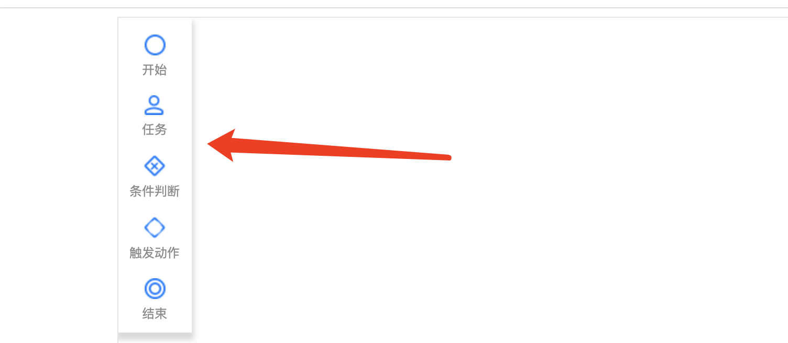

# 基于Logic Flow开发自定义扩展

> Logic Flow的核心部分只有最基础的图形编辑和渲染。我们可以基于 Logic Flow 开发很多大型的组件。这里以项目中内置的bpmn为例。（packages/bpmn）

## 自定义画板




### 创建`PluginLike`插件对象

自定义画板功能，我们可以通过 Logic Flow的插件系统来实现。首先我们需要定义一个PluginLike的插件对象，然后使用`Graph.addPlugin`将其添加到查 Logic Flow中。

```ts
export type PluginLike = {
  init(graph: Graph);
}

```

### 操作Logic Flow的HTML层

Logic Flow 目前分为两层，底层是基于`G`开发的`Graph`层，这一层的主要是渲染图形，目前是svg。上面一层是`HTML层`，这一层主要是放一些HTML相关的内容。因为svg内部并不能嵌套html，所以这里采用这种两层分开的方式。因为在`Graph层`有缩放、移动画布等交互。所以`Graph层`与`HTML层`存在着坐标的转换。我们在`graphTransform`中提供了`DomPointToGraphPoint`和`GraphPointToDomPoint`方法来协助坐标进行转换。

```ts
const pluginPalette: PluginLike = {
  init (graph): void {
    const htmlOverlay = graph.htmlOverlay;
    const paletteElement = createPalette();
    htmlOverlay.appendChild(paletteElement);
  }
};
```

### 监听画布抛出的事件

当我们从自定义画布中拖出一个自定义的工具放到画布的时候，画布会抛出事件`node:addByDragin`, 这个事件回调的event对象是画布内部自定义的对象。这个对象返回的`x,y`属性表示的是其所在画布的位置，`htmlX,htmlY`表示的是`HTML层`的位置。

我们知道，当进行拖拽的时候，可以使用`dataTransfer`来进行数据传递。但是这个在`Logic Flow`中会略微有点麻烦，因为 Logic Flow 返回的`event`是`graph`的事件。他的属性`originalEvent`才是`HTML层`事件。所以这里获取`dataTransfer`的方法是`ev.originalEvent.dataTransfer`.

```ts
img.addEventListener('dragstart', (e) => {
  e.dataTransfer.setData('type', item.type);
});
/*....*/

graph.on('node:addByDragin', (ev)=> {
  const type = ev.originalEvent.dataTransfer.getData('type');
  graph.addNode(type, {
    attrs: {
      x: ev.x,
      y: ev.y
    }
  });
});
```

从上面的代码可以看到，当我们把画布上的某个节点拖动到画布上了之后，我们需要调用 Logic Flow 提供的API，在对应的位置创建这个节点。那么这些怎么来的呢？这就需要用到下面的自定义节点功能了。


## 自定义节点

自定义节点教程亲参考[教程/进阶/自定义节点](/guide/advance/customNode.html)

todo: BPMN

## 自定义菜单

`Logic Flow`的内置插件有一个菜单插件，通过这个插件，我们可以很轻松的给节点添加菜单。

### 开发菜单的连线选项


