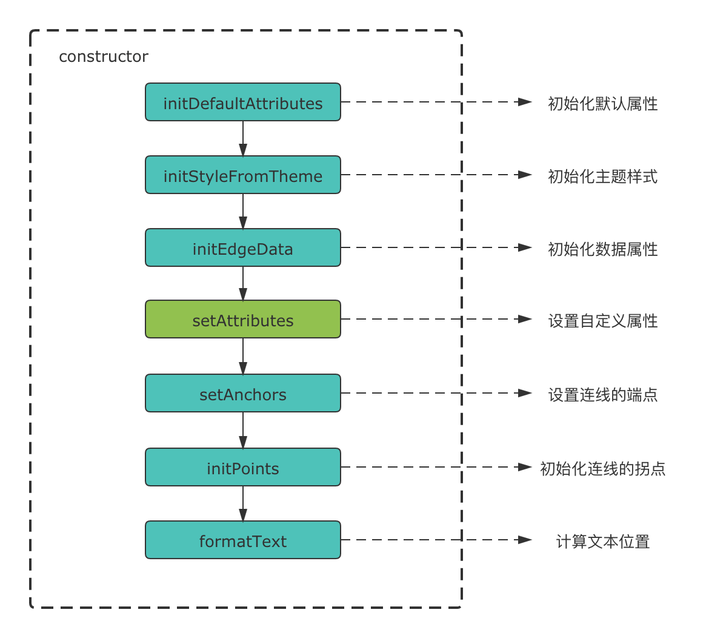

# 自定义连线

同自定义节点一样，在具体业务中我们也可能需要对连线进行一定的自定义，比如流程中高亮表示这个流程的执行路径。

## 自定义连线的 Model

连线的`model`中维护了以下内容。

- 连线的[通用属性](/api/edgeApi.html#通用属性)
- 连线的[边属性](/api/edgeApi.html#边属性)

不同类型的属性之间可能存在着依赖关系，为了保证每一种属性都可以正常使用，LF 在连线`model`的构造函数中按下图顺序进行初始化。



与节点一致，当各类属性被初始化完成后，LF 会主动调用`setAttributes`方法，因此我们可以用这个方法来对节点的属性进行自定义。

例如我们想要实现一条进度连线，若当前进度连线已执行，则显示为绿色。

```ts
lf.register('process', (RegisterParam) => {
  const { LineEdge, LineEdgeModel } = RegisterParam;
  class ProcessModel extends LineEdgeModel {
    setAttributes() {
      const { propteries: { isExecuted } } = this;

      if (isExecuted) {
        this.stroke = 'green';
      }
    }
  }
  return {
    view: LineEdge,
    model: ProcessModel,
  }
});
```

<example
  :height="250"
  iframeId="iframe-1"
  href="/examples/#/advance/custom-edge/process"
/>

## 自定义连线的 View

连线在`view`中维护了自身的`VNode`，Logic Flow 渲染连线时会调用`view`中的`getShape`方法来确定`VNode`该如何渲染。

### getShape

我们可以通过`getShape`方法返回 SVG 元素来实现连线的形状，但是内置的直线、折线和曲线已经能满足绝大部分需求，且连线的开发成本较高，这里不详细说明如何自定义连线的形状，如果有需要，建议直接阅读内部连线的[源码实现](https://github.com/didi/LogicFlow/blob/cdc19ddfb6774005b3f57cb4e27d54e8e25572b4/packages/core/src/view/edge/LineEdge.tsx)。也欢迎将你实现的自定义连线通过`extension`的方式提交 PR 给我们。

## extendKey

当我们注册的自定义连线希望可以被其他自定义连线继承时，就需要为`view`和`model`都设置一个静态属性`extendKey`，以便在`lf.register`的第二个回调函数的参数中被访问到。

```ts
lf.register('CustomEdge', ({ BaseEdge, BaseEdgeModel }) => {
  class View extends BaseEdge {
    static extendKey = 'CustomEdgeView';
  }
  class Model extends BaseEdgeModel {
    static extendKey = 'CustomEdgeModel';
  }
  return {
    view: View,
    model: Model,
  }
});
```
