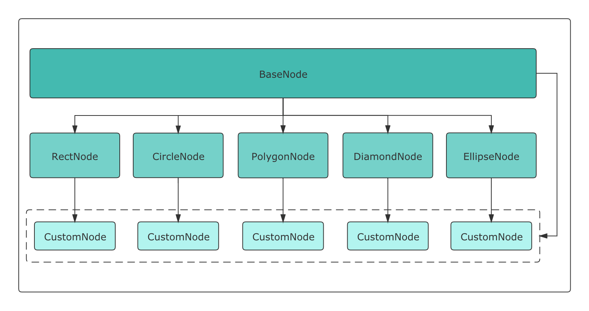
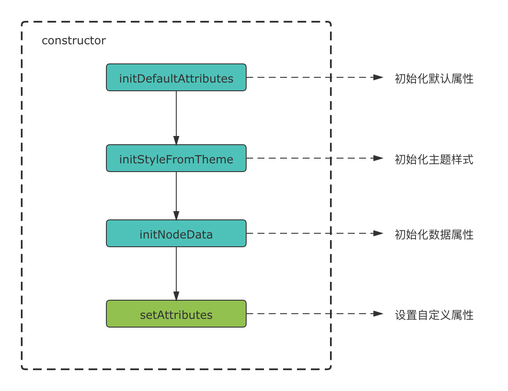

# 自定义节点

> LogicFlow 的元素是基于 SVG 实现的，如果你对 SVG 的相关知识还不太熟悉，那么推荐你先了解一下 [SVG](https://developer.mozilla.org/zh-CN/docs/Web/SVG) 的基础内容。

## 原理

### 基于继承的自定义节点

LogicFlow 对外暴露了基础节点`BaseNode`和 5 个简单类型的节点：
`RectNode`、`CircleNode`、`PolygonNode`、`EllipseNode`、`DiamondNode`。



由上图可以看到，LogicFlow 提供的简单节点都继承自内部的`BaseNode`，因此，用户的`CustomNode`既可以继承简单类型节点实现，也可以直接通过继承`BaseNode`来实现。

### MVVM

LogicFlow 内部是基于`MVVM`模式进行开发的，分别使用`preact`和`mobx`来处理 view 和 model，所以当我们自定义节点的时候，需要为这个节点定义`view`和`model`。

## 注册自定义节点

我们可以在创建`LogicFlow`实例之后，`render`之前，使用[`register`方法](/api/logicFlowApi.md#register)来注册自定义节点。

```ts
lf.register('customNodeType', (RegisterParam) => {
  const { RectNode, RectNodeModel } = RegisterParam;
  // 自定义节点的 model
  class Model extends RectNodeModel {}
  // 自定义节点的 view
  class View extends RectNode {}
  return {
    view: View,
    model: Model,
  }
});
```

`register`的第一个参数是自定义节点的类型，注册之后我们可以直接在`lf.render()`初始化时直接使用。

```ts
lf.render({
  nodes: [
    {
      id: 10,
      type: 'customNodeType',
      x: 300,
      y: 200,
    },
  ]
});
```

`register`的第二个参数可以为自定义节点定义`view`和`model`，`register`的第二个参数是一个回调函数，它的参数包含了 Logic Flow 内部所有节点的`view`和`model`，因此，我们可以通过**继承**这些内部的`view`和`model`来实现自定义节点的`view`和`model`，下文详细介绍了注册自定义节点的细节。

访问 [API](/api/logicFlowApi.md#register) 来查看`register`提供的`view`和`model`全集。

## 自定义节点的 Model

一个节点的正常渲染所需要的各类数据都源自于`model`，节点的`model`中包含了以下内容：

- 节点的[通用属性](/api/nodeApi.md#通用属性)（包含数据属性、样式属性、附加属性、状态属性）
- 简单节点的[节点属性](/api/nodeApi.md#节点属性)

不同类型的属性之间可能存在着依赖关系，为了保证每一种属性都可以正常使用，LF 在`model`的构造函数中按下图顺序进行初始化。



当各类属性被初始化完成后，LF 会主动调用`setAttributes`方法，因此我们可以用这个方法来对节点的属性进行自定义。

### 数据属性

从上图可以看到，数据属性在调用`setAttributes`之前就已经被初始化，它一般可以用来作为设置其他属性的依据。

```ts
class Model extends BaseNodeModel {
  setAttributes() {
    // 读取数据属性的 properties.color，并根据其值设置样式属性 stroke
    const { properties: { color } } = this;
    this.stroke = color;
  }
}
```

当接入方需要存放一些和节点相绑定的数据时，可以将其加入到`properties`中，Logic Flow 内部不会使用它，`properties`是自定义能力中最核心的一部分，通过`properties`可以实现业务中大部分逻辑需求。

> 注意：我们不推荐在`setAttributes`中对数据属性再做任何改动。

完整的数据类属性请访问 [API](/api/nodeApi.md#数据属性) 以查看更多细节。

### 样式属性

以正方形节点（square）为例，我们需要为节点设置`width`和`height`。

```ts
lf.register('square', (RegisterParam) => {
  const { RectNode, RectNodeModel } = RegisterParam;
  class SquareModel extends RectNodeModel {
    setAttributes() {
      const size = 80;
      this.width = size;
      this.height = size;
    }
  }
  return {
    view: RectNode,
    model: SquareModel,
  }
});

lf.render({
  nodes: [
    {
      id: 10,
      type: 'square',
      x: 300,
      y: 200,
      text: '正方形',
      properties: {}
    },
  ]
});
```

<example
  :height="250"
  iframeId="iframe-1"
  href="/examples/#/advance/custom-node/style"
/>

完整的的样式类属性请访问 [API](/api/nodeApi.md#样式属性) 以查看更多细节。

### 附加属性

我们可以通过附加属性为节点设置锚点的数量和位置、连线时的校验规则、特有的菜单选项。

#### 设置锚点的数量和位置

以正方形节点为例，如果我们只想使用水平方向上的左右两个锚点，则需要设置附加属性`anchorsOffset`。

```ts
lf.register('square', (RegisterParam) => {
  const { RectNode, RectNodeModel } = RegisterParam;
  class SquareModel extends RectNodeModel {
    setAttributes() {
      const size = 80;
      this.width = size;
      this.height = size;
      // 设置自定义锚点
      // 只需要为每个锚点设置相对于节点中心的偏移量
      this.anchorsOffset = [
        [size / 2, 0], // x 轴上偏移 size / 2
        [-size / 2, 0], // x 轴上偏移 -size / 2
      ];
    }
  }
  return {
    view: RectNode,
    model: SquareModel,
  }
});

lf.render({
  nodes: [
    {
      id: 10,
      type: 'square',
      x: 300,
      y: 200,
      text: '正方形',
      properties: {}
    },
  ]
});
```

<example
  :height="250"
  iframeId="iframe-2"
  href="/examples/#/advance/custom-node/anchor"
/>

在上例中，我们为`anchorsOffset`设置了一个数组，数组的每一项都是锚点相对于节点中心`(x, y)`的偏移量，例如`[size / 2, 0]`表示在 x 轴方向上从节点中心向右偏移宽度的一半，y 轴方向上不偏移。

#### 设置连线时的校验规则

在某些时候，我们可能需要控制连线的连接方式，比如开始节点不能被其它节点连接、结束节点不能连接其他节点、用户节点后面必须是判断节点等，要想达到这种效果，我们需要为节点设置以下两个属性。

- `sourceRules` - 当节点作为连线的起始节点（source）时的校验规则
- `targetRules` - 当节点作为连线的目标节点（target）时的校验规则

以正方形（square）为例，在连线时我们希望它的下一节点只能是圆形节点（circle），那么我们应该给`square`添加作为`source`节点的校验规则。

```ts
lf.register('square', (RegisterParam) => {
  const { RectNode, RectNodeModel } = RegisterParam;
  class SquareModel extends RectNodeModel {
    setAttributes() {
      const size = 80;
      const circleOnlyAsTarget = {
        message: "正方形节点下一个节点只能是圆形节点",
        validate: (source: any, target: any) => {
          return target.type === "circle";
        },
      };

      this.width = size;
      this.height = size;
      this.anchorsOffset = [
        [size / 2, 0],
        [-size / 2, 0]
      ];
      this.sourceRules.push(circleOnlyAsTarget);
    }
  }
  return {
    view: RectNode,
    model: SquareModel,
  }
});

lf.render({
  nodes: [
    {
      id: 10,
      type: 'square',
      x: 300,
      y: 200,
      text: '正方形',
      properties: {}
    },
  ]
});
```

<example
  :height="400"
  iframeId="iframe-3"
  href="/examples/#/advance/custom-node/rule"
/>

在上例中，我们为`model`的`sourceRules`属性添加了一条校验规则，校验规则是一个对象，我们需要为其提供`messgage`和`validate`属性。

`message`属性是当不满足校验规则时所抛出的错误信息，`validate`则是传入规则检验的回调函数。`validate`方法有两个参数，分别为连线的起始节点（source）和目标节点（target），我们可以根据参数信息来决定是否通过校验，其返回值是一个布尔值。

> 当我们在面板上进行连线操作的时候，Logic Flow 会校验每一条规则，只有**全部**通过后才能连接。

在连线时，当鼠标松开后如果没有通过自定义规则（`validate`方法返回值为`false`），Logic Flow 会对外抛出事件`connection:not-allowed`。

```js
lf.on('connection:not-allowed', (msg) => {
  console.log(msg)
});
```

#### 特有的菜单选项

自定义节点的菜单功能依赖于 [@logicflow/extension](/guide/extension/extension-components.html#组件) 拓展包的[菜单](/guide/extension/extension-components.html#菜单)组件。

```ts
class Model extends BaseNodeModel {
  setAttributes() {
    this.menu = [
      {
        text: '删除',
        callback(node) {
          // node为该节点数据
          lf.deleteNode(node.id);
        },
      },
    ]
  }
}
```

在`model`中，我们可以直接设置`menu`属性以达到只为某一类节点设置菜单的效果，`menu`的类型是一个数组，数组的元素表示菜单项，菜单项的具体配置请查看拓展包中的[菜单配置项](/guide/extension/extension-components.html#菜单配置项)。

> 为某一种类型的节点设置菜单，并不是只有设置`model`的`menu`这一种方式，更便于自定义的方式是直接通过[事件系统](/guide/advance/event.html#节点事件)来监听右键事件，然后根据事件所返回的数据去渲染自己的组件，实际上，`@logicflow/extension`中的菜单组件就是基于这个机制开发的。

完整的附加类属性请访问 [API](/api/nodeApi.md#附加属性) 以查看更多细节。

### 简单节点的节点属性

不同形状的简单节点所对应的 SVG 标签不同，其所需要的标签属性也略有不同，例如圆形需要设置半径`r`，椭圆需要设置 x 轴半径`rx`和 y 轴半径`ry`等。

如果我们需要通过继承多边形（Polygon）来实现一个三角形的节点，则需要为多边形设置节点属性`points`。

```ts
lf.register('triangle', (RegisterParam) => {
  const { PolygonNode, PolygonNodeModel } = RegisterParam;
  class TriangleModel extends PolygonNodeModel {
    setAttributes() {
      this.points = [
        [50, 0],
        [100, 80],
        [0, 80],
      ];
    }
  }
  return {
    view: PolygonNode,
    model: TriangleModel,
  };
});
```

<example
  :height="200"
  iframeId="iframe-4"
  href="/examples/#/advance/custom-node/triangle"
/>

完整的节点属性请访问 [API](/api/nodeApi.md#节点属性) 以查看更多细节。

## 自定义节点的 View

节点在`view`中维护了自身的`VNode`，Logic Flow 渲染节点时会调用`view`中的`getShape`方法来确定`VNode`该如何渲染。

### getShape

`getShape`方法可以返回任意 SVG 能识别的标签，目前需要使用 Logic Flow 提供的 `h` 方法来创建 SVG 元素。

仍然以正方形（square）节点为例，现在我们需要在正方形的左上角添加一个图标。

```js
lf.register('square', (RegisterParam) => {
  // h 方法由 Logic Flow 提供
  const { RectNode, RectNodeModel, h } = RegisterParam;
  class SquareModel extends RectNodeModel {
    setAttributes() {
      const size = 80;
      const circleOnlyAsTarget = {
        message: "正方形节点下一个节点只能是圆形节点",
        validate: (source: any, target: any) => {
          return target.type === "circle";
        },
      };

      this.width = size;
      this.height = size;
      this.anchorsOffset = [
        [size / 2, 0],
        [-size / 2, 0]
      ];
      this.sourceRules.push(circleOnlyAsTarget);
    }
  }
  class SquareView extends RectNode {
    getShape() {
      // 通过 getAttributes 获取 model 中的属性
      const { x, y, width, height, fill, stroke, strokeWidth } = this.getAttributes();
      const attrs = {
        // rect 标签的 x，y 对应的是图形的左上角
        // 所以我们要将矩形的中心移动到 x，y
        x: x - width / 2,
        y: y - height / 2,
        width,
        height,
        stroke,
        fill,
        strokeWidth
      }
      // getShape 的返回值是一个通过 h 方法创建的 svg 元素
      return h("g", {}, [
          h("rect", { ...attrs }),
          h(
            'svg',
            {
              x: x - width / 2 + 5,
              y: y - height / 2 + 5,
              width: 25,
              height: 25,
              viewBox: "0 0 1274 1024",
            },
            h(
              'path',
              {
                fill: stroke,
                d:
                  "M655.807326 287.35973m-223.989415 0a218.879 218.879 0 1 0 447.978829 0 218.879 218.879 0 1 0-447.978829 0ZM1039.955839 895.482975c-0.490184-212.177424-172.287821-384.030443-384.148513-384.030443-211.862739 0-383.660376 171.85302-384.15056 384.030443L1039.955839 895.482975z",
              }
            )
          )
        ]
      );
    }
  }
  return {
    view: SquareView,
    model: SquareModel,
  }
});

// 配置节点
lf.render({
  nodes: [
    {
      id: 10,
      type: 'square',
      x: 300,
      y: 200,
      text: '正方形',
      properties: {}
    },
  ]
});
```

<example
  :height="280"
  iframeId="iframe-5"
  href="/examples/#/advance/custom-node/shape"
/>

在上面的代码中，`getShape`方法返回了一个包含图标的标签，Logic Flow 拿到这个返回值后会直接在`graph`中进行渲染。SVG 元素需要 model 中的实时数据才可以正常显示并使用，现在我们可以通过[getAttributes](/guide/advance/customNode.html#getattributes)方法获取到 model 中的[数据属性](/api/nodeApi.md#数据属性)和[样式属性](/api/nodeApi.html#样式属性)。

## extendKey

当我们注册的自定义节点希望可以被其他自定义节点继承时，就需要为`view`和`model`都设置一个静态属性`extendKey`，以便在`lf.register`的第二个回调函数的参数中被访问到。

```ts
lf.register('CustomNode', ({ BaseNode, BaseNodeModel }) => {
  class View extends BaseNode {
    static extendKey = 'CustomNodeView';
  }
  class Model extends BaseNodeModel {
    static extendKey = 'CustomNodeModel';
  }
  return {
    view: View,
    model: Model,
  }
});
```
