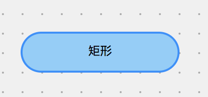

# 节点 Node

LogicFlow 的内置了一些基础节点，然后在实际应用场景中，我们可以基于这些基础节点，定义符合自己业务逻辑的节点。

::: warning 注意
LogicFlow推荐在实际应用场景中，所有的节点都使用自定义节点，将节点的type定义为符合项目业务意义的名称。而不是使用基础节点`rect`、`circle`这种仅表示外观的节点。
:::

## 基于继承的自定义节点
todo: 补一张图 mvp codesandbox

LogicFlow 对外暴露了基础节点`BaseNode`和 7 个基础类型的节点：
`RectNode`、`CircleNode`、`PolygonNode`、`EllipseNode`、`DiamondNode`、`TextNode`、`HtmlNode`。


由上图可以看到，LogicFlow 提供的简单节点都继承自内部的`BaseNode`，因此，用户的`CustomNode`既可以继承简单类型节点实现，也可以直接通过继承`BaseNode`来实现。

## 基础节点-RectNode

首先

```js
import { RectNode, RectNodeModel } from '@logicflow'
```

### 公共属性

| 名称  | 类型   | 是否必须 | 描述           |
| :---- | :----- | :------- | :------------- |
| id    | String |  ✅  | 节点 id|
| type | String | ✅ | 节点类型 |
| x | number | ✅ | 节点中心x轴坐标 |
| y | number | ✅ | 节点中心y轴坐标 |
| text | Object/String  |  | 节点文本 |
| properties | Object |  | 节点自定义属性 |

### 私有属性

#### 矩形
| 名称  | 类型   | 是否必须 | 描述           |
| :---- | :----- | :------- | :------------- |
| radius | number | ✅ | 矩形圆角 |

#### 圆形
| 名称  | 类型   | 是否必须 | 描述           |
| :---- | :----- | :------- | :------------- |
| r | number | ✅ | 圆形半径 |

#### 椭圆
| 名称  | 类型   | 是否必须 | 描述           |
| :---- | :----- | :------- | :------------- |
| rx | number | ✅ | 椭圆x轴半径 |
| ry | number | ✅ | 椭圆y轴半径 |

#### 菱形
| 名称  | 类型   | 是否必须 | 描述           |
| :---- | :----- | :------- | :------------- |
| rx | number | ✅ | 菱形x轴宽度的1/2 |
| ry | number | ✅ | 菱形y轴高度的1/2 |
#### 多边形
| 名称  | 类型   | 是否必须 | 描述           |
| :---- | :----- | :------- | :------------- |
| points | Point[] | ✅ | 多边形端点坐标 |

【注意】`points`为多边形相对于画布坐标轴起点的各个端点的坐标，如果要修改多边形的大小，可以通过计算目标大小的多边形的坐标并修改`points`来实现，通过公共属性`x`和`y`来确定多边形的位置。
```ts
type Point = [number, number]
```
#### 文本
| 名称  | 类型   | 是否必须 | 描述           |
| :---- | :----- | :------- | :------------- |
| fontSize | number | ✅ | 字体大小 |
| fontFamily | string | ✅ | 字体类型 |
| fontWeight | number / string | ✅ | 字体粗细 |

### html节点

html节点无特殊属性，定制效果需要去view中自己控制。详情请参考自定义节点。

## 创建节点
LogicFlow 支持三种创建节点的方式：
- 数据配置
- 函数调用
- 拖拽创建节点

### 数据配置创建节点

在图初始化时，通过配置数据创建节点。

```ts
lf.render({
  nodes: [
    {
      id: 10,
      type: 'rect',
      x: 150,
      y: 70,
      text: '矩形'
    }
  ],
  edges: [...],
});
```

<example :height="230" ></example>

### 函数创建节点

在实例化 `LogicFlow` 后，通过调用 `lf.addNode` 创建节点。创建节点的参数包括节点类型、位置信息、文案信息、自定义属性等。节点的完整配置参见 [Node API](/api/nodeApi.html)。

```ts
lf.addNode({
  type: 'rect',
  x: 100,
  y: 100,
});
```
### 拖拽创建节点
在流程图编辑场景中比起通过代码配置注册节点以外，可能更需要通过图形用户界面来操作创建流程图，这时候就可以通过拖拽的方式来实现。详情参见[拖拽Dnd API](/guide/basic/dnd.html)


## 常用方法

### lf.addNode

创建节点

**参数**

| 名称   | 类型   | 描述            |
| :----- | :----- | :------- | :-------------- |
| nodeConfig | NodeConfig| 节点数据 |
``` ts
type NodeConfig = {
  id?: string;
  type: string;
  x: number;
  y: number;
  text?: TextConfig;
  properties?: Record<string, unknown>;
};
```

**返回值**  

无

**用法**

``` ts
lf.addNode(nodeConfig: NodeConfig);

// 示例-创建节点
lf.addNode({
  type: 'rect',
  x: 100,
  y: 100,
});
```

### lf.getNodeDataById

获取节点数据

**参数**
| 名称   | 类型   | 描述            |
| :----- | :----- | :------- | :-------------- |
| nodeId | string | 节点Id |

**返回值**  

| 名称   | 类型   | 描述            |
| :----- | :----- | :------- | :-------------- |
| nodeData | NodeData | 节点Id |
``` ts
// 节点数据
type NodeData = {
  id: string;
  type: string;
  x: number;
  y: number;
  text: TextConfig;
  properties: Record<string, unknown>;
};
```

**用法**

``` ts
lf.getNodeDataById(nodeId);
```

### lf.setNodeData

设置节点数据(即将废弃，如果想要修改properties，请使用setProperties。如果想要修改id请使用setNodeId)

**参数**
| 名称   | 类型   | 描述            |
| :----- | :----- | :------- | :-------------- |
| nodeAttribute | NodeAttribute | 节点数据 |
``` ts
// 修改节点数据的参数
export type NodeAttribute = {
  id: string;
  type?: string;
  x?: number;
  y: number;
  text?: TextConfig;
  properties?: Record<string, unknown>;
};
```

**返回值**  
无

**用法**

``` ts
lf.setNodeData(nodeData);
```

### lf.deleteNode

删除节点

**参数**
| 名称   | 类型   | 描述            |
| :----- | :----- | :------- | :-------------- |
| nodeId | string | 节点Id |

**返回值**  

无

**用法**

``` ts
lf.deleteNode(nodeId);
```
### lf.cloneNode

复制节点

**参数**
| 名称   | 类型   | 描述            |
| :----- | :----- | :------- | :-------------- |
| nodeId | string | 节点Id |

**返回值**  

| 名称   | 类型   | 描述            |
| :----- | :----- | :------- | :-------------- |
| nodeId | NodeData | 节点Id |

``` ts
// 节点数据
type NodeData = {
  id: string;
  type: string;
  x: number;
  y: number;
  text: TextConfig;
  properties: Record<string, unknown>;
};
```

**用法**

``` ts
lf.cloneNode(nodeId);
```

### lf.focusOn
将节点定位到画布中心

**参数**

| 名称   | 类型    | 描述         |
| :------ | :----- | :-------- |:-------- | :----------- |
| id  | String  |   图形的id   |
| coordinate  | Object  |  图形当前的位置坐标   |

**返回值**  

无

**用法**

```js
lf.focusOn({
  id: '22'
})

lf.focusOn({
  coordinate: {
    x: 11,
    y: 22
  }
})
```

Node 的完整函数参见 [Node API](/api/nodeApi.html)。

## 节点扩展
LogicFlow 内部为各个图形设置了默认的样式属性，例如：宽、高、填充颜色、边框颜色、透明度等。默认配置参见[Theme API](/guide/advance/theme.html)。

### 节点样式属性

| 名称  | 类型   | 是否必须 | 描述           |
| :---- | :----- | :------- | :------------- |
| width | number | ✅ | 节点宽度 |
| height| number | ✅ | 节点高度 |
| fill  | color  | ✅ | 节点填充颜色 |
| fillOpacity | number  | ✅ | 节点填充颜色透明度 |
| stroke | color  | ✅ | 节点边框颜色 |
| strokeOpacity | number  | ✅ | 节点边框颜色透明度 |
| strokeWidth | number  | ✅ | 节点边框宽度 |
| opacity | number  | ✅ | 节点整体透明度 |
| outlineColor | color  | ✅ | 外框颜色 |

###  主题定制
> 如果想要重新设置图形的样式，例如：宽高、半径、填充颜色、边框颜色等。可以通过自定义主题的方式实现。

**将矩形样式设置为宽为160，高为40，圆角20，边框色值#1E90FF，填充色值#87CEFA**
  ``` ts
  // 设置矩形主题
  lf.setTheme(
    {
      rect: {
        width: 160,
        height: 40,
        fill: '#87CEFA',
        stroke: '#1E90FF',
        radius: 20,
      },
    }
  );
  // 新增矩形节点
  lf.addNode({
    type: 'rect',
    x: 300,
    y: 300,
    text: '矩形'
  })
  ```
  


  主题的完整设置，参见 [主题 Theme 样式 API](/guide/advance/theme.html)

  ### 自定义节点
  > 如果想要更高维度的个性化设置，例如不同样式的矩形、业务属性，可以通过自定义节点的方式实现，具体参见 [自定义节点 API](/guide/advance/customNode.html)。
