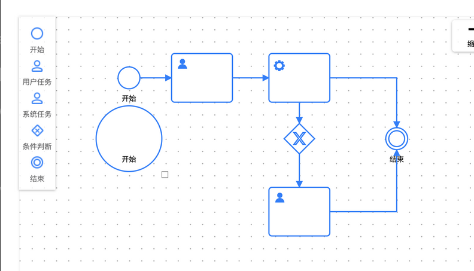

# 简介

> Logic Flow 最初的目标就是支持一个扩展性强的流程绘制工具，用来满足各种业务需求。

目前所有内置的拓展都在`lf-extension`包中，其中包括组件、`BpmnElement`、`RectLabelNode`、`ResizeNode`、`Snapshot`、`Adapter`。

## 使用拓展

```js
import { ResizeNode } from 'lf-extension/lib/resizeNode';
LogicFlow.use(ResizeNode);
```

```html
<script src="/logic-flow.js"></script>
<script src="/lib/ResizeNode.js"></script>
<script>
  LogicFlow.use(ResizeNode);
</script>
```

## 自定义拓展

实现一个 Logic Flow 的扩展非常简单，那就是对外暴露一个对象，这个对象有一个方法 install。Logic Flow 会在初始化的时候执行这个方法，将其实例传递进来。开发者基于这个实例，利用 Logic Flow 的自定义机制开发，就可以实现一个插件。

```js
window.ResizeNode = {
  install: function(lf) {
    // 基于lf进行扩展
  }
}
```

## 基于拓展的奇妙组合

Logic Flow 中一个拓展的功能可能很简单，但是多个拓展一起却可以组成强大的功能。比如我们的 BPMN 中的开始节点是继承 Logic Flow 内置的 circle 实现的，我们的`ResizeNode`可以将内置的`circle`设置为可以调整大小的节点。那么我们可以先使用`ResizeNode`再使用`BpmnElement`. 这个时候，我们绘制 BPMN 就可以调整节点的大小了。


