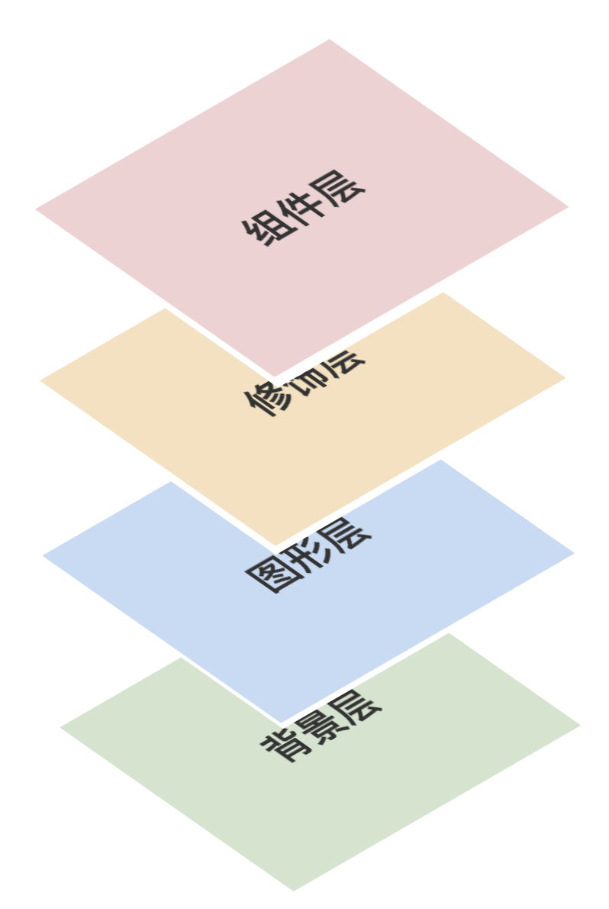

LogicFlow provides a lot of plug-ins, but these plug-ins are some of the plug-ins with universal,
not always meet the business needs. You can customize the plug-ins based on your business scenarios.

## Plug-in base format

```tsx | pure
class PluginCls {
  static pluginName = 'pluginName'

  constructor({ lf, LogicFlow }) {
    // do anything
  }

  render(lf, toolOverlay) {
    // do anything
  }

  destroy() {
    // do anything
  }
}
```

- A plugin is a class.
- The class has a static property `pluginName` that identifies the name of the plugin. Plugins with
  the same name are overridden when initializing an instance of `lf`, also, the user can get an
  instance of the class plugin by `lf.extension.pluginName`.
- When initializing `lf` instances, plugin instances are initialized at the same time, and the
  parameters `lf` and `LogicFlow` are passed in.
- After `lf` is rendered, the `render` method of the plugin instance is called (if any). The second
  parameter, toolOverlay, is a node representing the `LogicFlow` Dom layer. Plugin developers can
  insert html content directly into this node.
- `destroy` is the method that is called to destroy the plugin. It can be left out in most cases.

## Implementing the context-pad plugin

The following is an example of implementing a `context-pad` plugin to show you how to define a
plugin that fits your business. A `context-pad` plugin is a node that, when clicked on, displays an
optional shortcut action next to the node, which can be thought of as a menu that appears when
left-clicked on.

### Add plug-in option method

LogicFlow mounts instances of plugins as plugin names on `lf.extension` so that our methods
in `class` can be called with `lf.extension.plugin-name. PluginMethods` calls.

```tsx | pure
class ContextPad {
  setContextMenuItems(items) {
    this.commonMenuItems = items;
  }
}

ContextPad.pluginName = "contextPad";

lf.extension.contextPad.setContextMenuItems([
  {
    icon: "...",
    callback: () => {},
  },
]);
```

### Listening for nodes to be clicked

When the plugin is initialized, `lf` is passed to the plugin as a parameter, which can then be used
to listen for events occurring on the canvas.

```tsx | pure
class ContextPad {
  constructor({ lf }) {
    lf.on("node:click", (data) => {
      this.showContextPad(data);
    });
  }

  showContextPad() {
    // ...
  }
}
```

### Displaying HTML content at a specified location on the canvas

The plugin's render function takes two arguments, `lf` and `toolOverlay`, which is the component
layer; LogicFlow's canvas is made up of multiple layers, and the component layer is dedicated to
rendering custom components.

**LogicFlow's diagram layers**



So here we just need to insert the menu into `toolOverlay`, and then move its menu to the
corresponding position.

```tsx | pure
class ContextPad {
  render(lf, toolOverlay) {
    this.toolOverlay = toolOverlay;
  }

  createMenu() {
    this.__menuDOM = document.createElement("div");
  }

  // Calculate where the menu should be displayed (top right corner of the node)
  getContextMenuPosition() {
    const data = this._activeData;
    const Model = this.lf.graphModel.getElement(data.id);
    let x;
    let y;
    if (Model.BaseType === "node") {
      x = data.x + Model.width / 2;
      y = data.y - Model.height / 2;
    }
    return this.lf.graphModel.transformModel.CanvasPointToHtmlPoint([x, y]);
  }

  showMenu() {
    const [x, y] = this.getContextMenuPosition();
    this.__menuDOM.style.display = "flex";
    // Display the menu to the corresponding position
    this.__menuDOM.style.top = `${y}px`;
    this.__menuDOM.style.left = `${x + 10}px`;
    this.toolOverlay.appendChild(this.__menuDOM);
  }
}
```

## example

<a href="https://codesandbox.io/embed/logicflow-base22-rl301?fontsize=14&hidenavigation=1&theme=dark&view=preview" target="_blank"> Go to CodeSandbox for examples</a>
